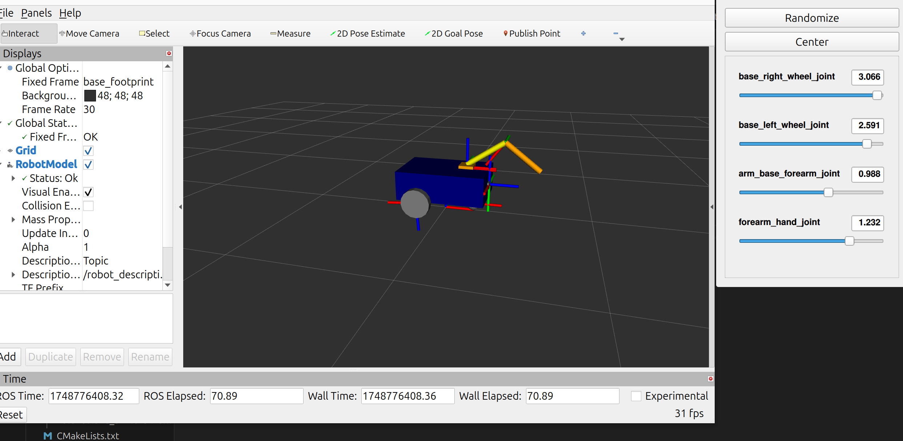

# 🤖 Differential Drive Robot with Robotic Arm (ROS 2 Project)

This repository showcases a complete robotics simulation project developed as part of the [Udemy Course: *ROS 2 for Beginners Level 2 – TF | URDF | RViz | Gazebo*](#)  

---

## 🧠 Project Overview

This project involves the design, modeling, and simulation of a differential drive robot equipped with a robotic arm. The project uses concepts from TF broadcasting, URDF modeling, Xacro scripting, and Gazebo simulation.

---

## 🧰 Tech Stack

- **Programming Languages:** Python, XML  
- **Frameworks & Middleware:** ROS 2 Jazzy  
- **Operating System:** Ubuntu 24.04.2 LTS  
- **Simulation:** Gazebo Harmonic v8.9.0  
- **Visualization:** RViz  

---

## 📚 Key Learning Outcomes

During the course and this project, I gained hands-on experience in:

1. **Transform Frames (TF):** Understanding and visualizing coordinate frames using `tf2` in RViz.
2. **URDF Modeling:** Building both a differential drive robot and a robotic arm using Unified Robot Description Format (URDF).
3. **Inertial and Collision Tags:** Enhancing robot realism and safety within simulations.
4. **ROS 2 Launch Files:** Automating node and simulation startup with custom launch files.
5. **Xacro Macros:** Optimizing and modularizing URDF files using Xacro.
6. **Function Definitions in Xacro:** Creating parameterized robot models for scalability.
7. **Gazebo Integration:** Simulating the complete robot system and verifying its motion and structure in a realistic environment.

---

## 🛠️ Project Highlights

- Built a **differential drive robot base** from scratch.
- Mounted a **multi-jointed robotic arm** on the base using modular URDF + Xacro.
- Configured **inertial dynamics and collision properties** to simulate physical behavior accurately.
- Launched and visualized the system in **Gazebo** and **RViz**, using TF frames for reference validation.
- Developed **launch files** for seamless simulation execution and testing.

---

## 📸 Screenshots

---

## 📍 Final Thoughts

This project solidified my understanding of robotic simulation pipelines using ROS 2 and Gazebo. It reflects both my theoretical knowledge and practical ability to build and simulate complex robotic systems.  

Feel free to explore the code and reach out for collaboration or questions.
